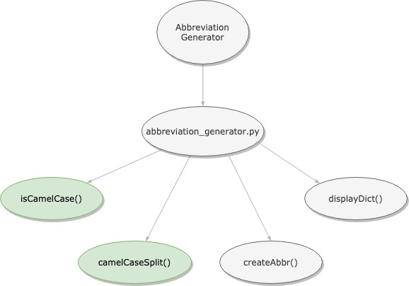

# Abbreviation Generator

A program that reads keywords (in camelCase) from a text file and makes abbreviations for them. The output would be a dictionary with abbreviations as keys and a list of its keywords as values.

Check out full Medium article [here](https://medium.com/@sanjitunv/understanding-unit-testing-in-python-part-ii-88cb8e09f296)

### App Composition


### Working


### To Run from Terminal

```
> python3 abbreviation_generator.py
```

### Output
```
{
    'AAA': ['agriculturalAdjustmentAct'],
    'CCC': ['civilianConservationCorps', 'commodityCreditCorporation'],
    'FDIC': ['federalDepositInsuranceCorp'],
    'BBC': ['britishBroadcastingCorporation'],
    'UAE': ['unitedArabEmirates']
}
```
